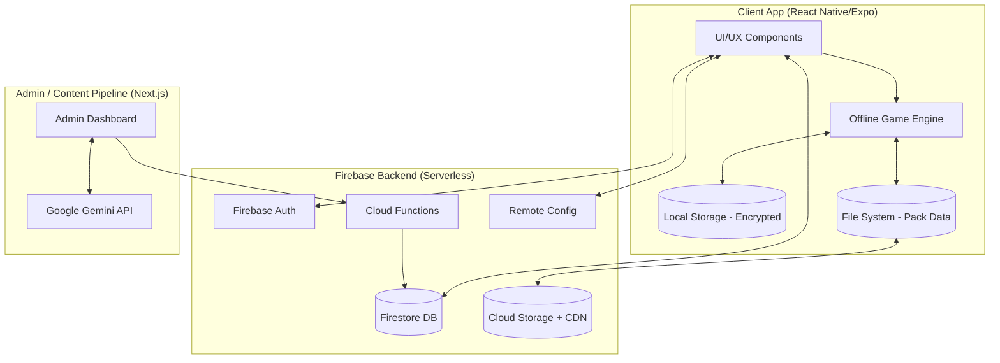

# 🇳🇬 Technical Architecture & Functional Requirements (FRD)
**Project: Daily Naija Trivia**

This document outlines the technical specifications, system architecture, and detailed functional flows required to execute the product vision for Daily Naija Trivia at a production scale, easily supporting over 100k daily users.

---

## 1. System Architecture Overview

The platform uses a decoupled, offline-first mobile architecture supported by a serverless backend and an AI-driven content generation pipeline.



---

## 2. Detailed Technical Flows

### 2.1 Authentication & Onboarding Flow
**Objective:** Securely authenticate users and personalize their experience with minimal friction.
1. **App Launch**: Check local `MMKV` for an existing auth token.
    - *If True*: Validate token asynchronously; route to Dashboard.
    - *If False*: Show Splash Screen -> Route to Auth Provider.
2. **Auth Providers**: User selects Google, Apple, Email, or Guest (Firebase Anon). Apple/Play Store payment gateways handle all monetization.
3. **Backend Registration**: Firebase Auth handles OAuth. Upon success, a `user_created` trigger fires.
4. **Profile Creation**: A user document is created in `Firestore` (`users/{uid}`).
5. **Cultural Profiling**: UI presents interest categories. Selection is saved to `Firestore` and cached in `MMKV`.

### 2.2 Content Delivery & Pack Versioning Flow
**Objective:** Enable zero-latency gameplay, minimize Nigerian data costs, and keep content up to date.
1. **Catalog Fetch**: App fetches lightweight catalog metadata (pack ID, title, size, version) from `Firestore`.
2. **Version Check**: Client checks `if (localVersion < serverVersion) → show "Update Pack"`.
3. **Download**: App downloads the compressed `pack_{id}.json.gz` payload from Firebase `Cloud Storage + CDN`.
    - Note: `.gz` compression shrinks pack size by up to 70%.
4. **Persistence**: File is stored in `ExpoFileSystem.documentDirectory`.
5. **State Update**: `MMKV` updates local state `downloadedPacks: string[]` to reflect availability.

### 2.3 Core Gameplay Engine Flow
**Objective:** High-performance rendering of questions and complex scoring.
1. **Initialization**: Engine reads the decompressed pack synchronously from `FileSystem`.
2. **Game Config Fetch**: Engine fetches the latest game economy constants (`base_score`, `streak_multiplier`, `daily_bonus`) from **Firebase Remote Config**.
3. **Game Loop**:
    - Render question + options.
    - **Preload Next Question**: While question N is visible, preload question N+1 for instant UI response and smoother gameplay.
    - Dispatch `StartTimer` action.
4. **Answer Event**:
    - Calculate Points: `BasePoints + (SpeedBonus × StreakMultiplier)`.
    - Update local temporal state (`currentScore`, `correctAnswers`).
5. **Completion Event**:
    - Accumulate total score and Naija Coins.
    - Save results locally to `MMKV`.
    - Enqueue `ScoreSync` job to Cloud Functions.

### 2.4 Score Validation & Sharded Sync Flow
**Objective:** Prevent tampering and abuse while scaling leaderboard writes safely.
1. **Submission**: App calls Cloud Function with: `score`, `correctAnswers`, `timeTaken`, `packId`.
2. **Server Validation**: Cloud Function validates bounds:
    - `if (score > MAX_SCORE_PER_PACK) reject`
    - `if (timeTaken < MIN_POSSIBLE_SPEED) reject`
    - Verify `answers.length === pack.questionCount`
3. **Rate Limiting & Abuse Prevention**: Function checks `/users/{uid}/completedPacks/{packId}` to ensure the user hasn't already submitted a score for this event.
4. **Sharded Leaderboard Writes**:
    - Function distributes writes across shards to prevent "hot document" bottlenecks.
    - E.g.: `leaderboards/daily/history/shard_1`
    - Scheduled jobs aggregate these shards asynchronously.

---

## 3. Firebase Architecture Optimizations ⚡

The Firestore database structure is optimized for high-read, low-write game loops.

**Firestore Collections**
- **Users**: `/users/{uid}`
- **Packs Metadata**: `/packs/{packId}` (title, category, difficulty, questionCount, version, fileUrl, size)
- **Leaderboards (Sharded)**: `/leaderboards/{region}/{category}/shard_1`, `/leaderboards/{region}/{category}/shard_2`
- **Completed Packs Tracker**: `/users/{uid}/completedPacks/{packId}` (score, completionTime, correctAnswers)

---

## 4. Key Security Improvements 🔐
- **Score Protection**: Scores can NEVER be written directly by the client. Only Cloud Functions have write access to Leaderboards and `completedPacks`.
- **Firebase Security Rules**: 
  ```javascript
  match /users/{uid} {
    allow read, write: if request.auth.uid == uid
  }
  ```
- **MMKV Encryption**: Use `react-native-mmkv` with `withEncryption`. Keys are securely generated and stored in Android Keystore / iOS Keychain.

---

## 5. Scaling Improvements 📈
By pushing gameplay logic entirely locally and utilizing `Firebase Storage + CDN` for heavy pack downloads, the backend is shielded from synchronous polling. Firestore load comes entirely from lightweight async score submissions and catalog reads, allowing the architecture to trivially scale to **100k daily active users** with minimal operational modifications.

---

## 6. Missing System Components & Analytics
- **Firebase Analytics**: Tracks essential events: `pack_download`, `pack_completed`, `question_wrong`, `question_correct`, `subscription_started`. Vital for difficulty balancing and content popularity tracking.
- **Firebase Crashlytics**: Essential for proactive mobile game stability monitoring and debugging.
- **Firebase Cloud Messaging (FCM)**: Push notifications to drive retention (e.g., "New Yoruba History Pack Released!", "Your friend beat your score!").
- **Remote Config**: Game variables are managed here, preventing the need for an App Store / Play Store update just to tweak the game economy.
- **Monetization Gateways**: Subscription processing and purchases managed exclusively via native App Store (iOS) and Play Store (Android) integrations (e.g., via RevenueCat).
